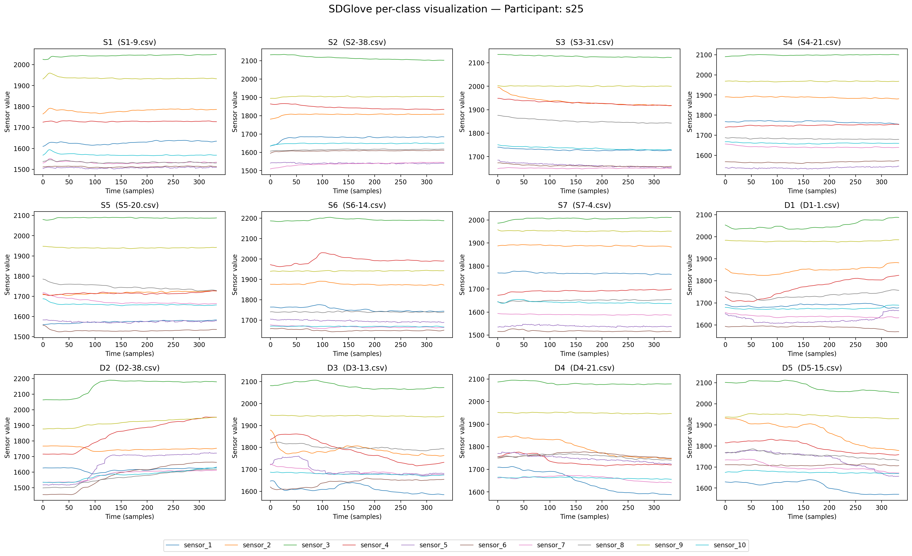

# SDGlove(Static and Dynamic hand gesture dataset with soft sensor-embedded Glove)
This dataset consists of **time-series sensor data** collected while performing hand gestures wearing a **soft sensor-embedded glove**. It includes both **static and dynamic gestures**, collected from **30 subjects** to provide richer soft-sensor-based hand-gesture data.

## File structure
```
SDGlove/
├── SDGlove.zip                                # Full dataset — 13,421 gesture records 
│   └── s#/                                   
│       └── {Gesture_num}-{Iteration_num}.csv
├── per_class_visualization.ipynb
├── per_class_s25.png                          # Per-class visualization example
├── Participant_info.md                        # Participant details
├── README.md                
└── NOTICE.md
```

## Tasks
Research using hand gesture recognition based on this dataset can be applied in environments such as:
- Virtual safety training and robot teleoperation
- Healthcare
    - Hand rehabilitation exercises
    - Assistive communication devices 
    - Sign language education
- VR/AR devices
    - User interface (UI) and menu navigation
    - Virtual object and content interaction

## Data description
1. **Data format**: CSV
2. **Total number of data**: 13,421 gestures
3. **Length per iteration**: approximately 5 seconds
4. **Column description**
    | Column | Description |
    |-----|------|
    |sensor_1|Thumb MCP|
    |sensor_2|Thumb PIP|
    |sensor_3|Index MCP|
    |sensor_4|Index PIP|
    |sensor_5|Middle MCP|
    |sensor_6|Middle PIP|
    |sensor_7|Ring MCP|
    |sensor_8|Ring PIP|
    |sensor_9|Little MCP|
    |sensor_10|Little PIP|


## Experimental setup
1. **Number of [Participants](./Participant_info.md)**: 30
2. **Number of gesture classes**: 12
    - **Static gesture** (S1~S7)
    - **Dynamic gesture** (D1~D5)
    
    
3. **Data collection device**: Mollison Hand (Feel the Same Inc., Korea, soft sensor-embedded glove)
    
    - Sensor configuration: Soft sensors at each finger joint (measuring resistance values based on the degree of flexion at MCP and PIP)
    - Sampling rate: Collected every 15ms


5. **Collection procedure**
    - Glove worn on the participant's dominant hand
    - Each gesture performed 40 times in random order.
    - Gesture performance duration: 5 seconds
    - Rest time between gestures: 3 seconds
 
6. **Basic preprocessing** (for incorrectly performed gestures)
    - If a gesture from a different class was performed → relabeled to the corresponding class
    - If a completely incorrect gesture was performed → removed


## Usage
### Requirements
```bash
pip install numpy pandas matplotlib jupyter
```

### Per-class visualization
`per_class_visualization.ipynb` randomly selects one participant from `SDGlove/`, then randomly picks one instance per gesture class (`S1–S7`, `D1–D5`) and plots the 10 sensor channels (`sensor_1`–`sensor_10`) as time series, with all 12 classes shown together in a single figure (one subplot per class).

```bash
jupyter nbconvert --to notebook --execute --inplace per_class_visualization.ipynb
```

### Output


*Example: 12 gesture classes (S1–S7, D1–D5) for one randomly sampled participant (s25), each subplot overlaying the 10 sensor channels over time.*

---

## citation (Bibtex)
- If you want to cite our datasets, you can use our paper:
```
our bibtex
```

## publications using this dataset

| Paper title | Journal/Conference | Year |
|-----|------|-----|

## license
This project is licensed under the MIT License - see the [LICENSE](./LICENSE) file for details.

## remark
